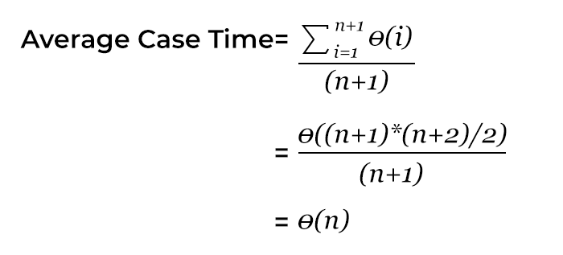

# Types of Analysis

We can have three cases to analyze an algorithm:

- Worst Case
- Average Case
- Best Case

## Worst Case Analysis
- We calculate upper bound on running time of an algorithm.
- We must know the case that causes the maximum number of operations to be executed. 

### Example
Linear Search
- The worst case happens when the element to be searched is not present in the array.
- When element is not present, function will traverse the whole array
- The worst case time complexity of linear search would be $O(N)$, where $N$ is the number of elements in the array.

## Average Case
- We take all possible inputs and calculate computing time for all of the inputs.
- Sum all the calculated values and divide the sum by total number of inputs.
- We must know (or predict) distribution of cases.

### Example
Linear Search
- Let us assume that all cases are uniformly distributed
- (including the case of element not being present in array).
- So we sum all the cases and divide the sum by (N+1)

Following is the value of average case time complexity.

## Best Case
- We calculate lower bound on running time of an algorithm.
- We must know the case that causes minimum number of operations to be executed.

### Example
Linear Search
- The best case occurs when element is present at the first location.
- The number of operations in the best case is constant.
- So time complexity in the best case would be $O(1)$.

## Time Complexity Analysis (Big-O Notation)

- Best Case $O(1)$
    - Element is on the first index.
    - The number of comparisons is 1.

- Average Case $O(n)$
    - Element is in the middle.

- Worst Case $O(n)$
    - Element is on the last index. OR
    - Element is not present.

## Important Points

- Most of the times, we do the worst case analysis to analyze algorithms.
- In the worst analysis, we guarantee an upper bound on the running time of an algorithm which is a good piece of information.
- The average case analysis is not easy to do in most of the practical cases and it is rarely done.
- In the average case analysis, we must know (or predict) the mathematical distribution of all possible inputs.
- The Best Case analysis is bogus.
- Guaranteeing a lower bound on an algorithm doesn't provide any information as in the worst case, an algorithm may take years to run.