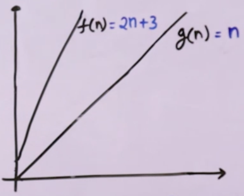

# Omeaga Notation $\quad \Omega(n)$

It is used to represent Exact or Lower Bound on Order of Growth

### Steps
- Ignore lower order terms
- Ignore leading term constant

### Example

- $3n^2 + 5n + 6 \qquad \Omega(n^2) \quad or \quad \Omega(n) \quad or \quad \Omega(1)$
- $3n + 10n\log n + 3 \qquad \Omega(n\log n) \quad or \quad \Omega(n)$
- $10n^3 + 40n + 10 \qquad \Omega(n^3) \quad or \quad \Omega(n^2)$

## Mathematical Representation of Big O Notation

We say $f(n) = \Omega(g(n)) \qquad iff$  there exist constants $C$ (where $C > 0$) and $n_0$ (where $n_0 > 0$) such that $Cg(n) \le f(n)$ for all $n \ge n_0$

### Example

$f(n) = 2n + 3$ 

can be written as $\Omega(n)$ where ($g(n) = n$)

So, we say $f(n) = 2n + 3$ is $O(n)$, only when there exists a constant $C$ such that 

$2n+3 \ge Cn$, for all $n \ge n_0$

We need to find value of $C$ and $n_0$ and show that this is true.

### Proof

$$f(n) = 2n + 3$$

let $C = $ constant of highest growing term - 1.

$$C = 1$$
$$2n + 3 \ge 1n$$
$$3 \ge -n$$
$$-3 \le n$$
which means this will be also true for
$$0 \le n$$
we get 
$$n_0 = 0$$ 




## Examples of Omega Notation

$$ \{ n^2 + n, \quad 2n^2, \quad n^2 + 1000n, \quad n^2 + n\log n + n, \quad \frac{n^2}{1000}, \quad  ..... \} \quad \epsilon \quad \Omega(n^2) $$

$$ \cup \quad \{ \frac{n}{4}, \quad 2n + 3, \quad \frac{n}{100} + \log n, \quad n + 10000, \quad \log n + 10, \quad  ..... \} \quad \epsilon \quad \Omega(n) $$

$$ \cup \quad \{ 100, \quad  \log 2000, \quad (10)^4, \quad ..... \} \quad \epsilon \quad \Omega(1) $$


## Omega is opposite of Big O

$$f(n) = O(g(n))$$
$$g(n) = \Omega(f(n))$$


### Multiple Variables
Omega Notation works for Multiple Variables also

$100n^2 + 1000m + n \qquad \Omega(n^2 + m)$ 

$1000m^2 + 200mn + 30m + 20n \qquad \Omega(m^2 + mn)$

## Applications
Used when we have an Lower Bound

- Suppose there a game which keeps on running until a player quits
- We don't know for how long the program will run
- Program also calculates scores of $n$ players
- We only have lower bound, that atleast it will run $n$ no. of times
- So we can say its Time Complexity is $\Omega (n)$


### Print all the possible pairs of an array. 
The idea is to run two nested loops to generate all the possible pairs of the given array. 

```
int print(int a[], int n)
    for (int i = 0; i < n; i++) 
        for (int j = 0; j < n; j++)
            if(i != j)
                cout << a[i] << " " 
                     << a[j] << "\n";
```

- Print statement gets executed $n^2$ times
- Therefore Running Time vs $n$ graph is a parabolic graph, $f(n^2)$
- Now linear functions $g(n)$, logarithmic functions $g(\log n)$, constant functions $g(1)$ all are less than a parabolic function when the input range tends to infinity
- Therefore, the worst-case running time of this program can be $\Omega(\log n)$, $\Omega(n)$, $Omega(1)$, or any function $g(n)$ which is less than $n^2$ when $n \to \infty$. 
- See the below graphical representation

