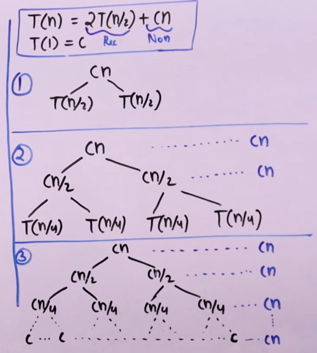
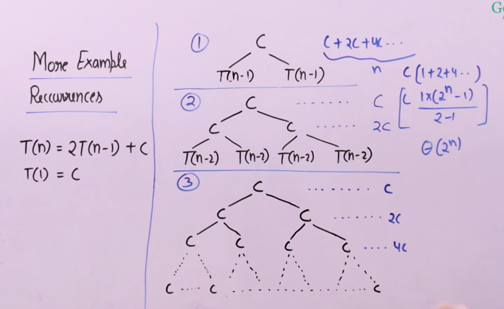
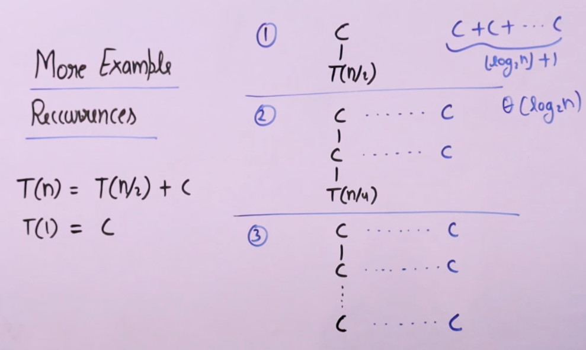
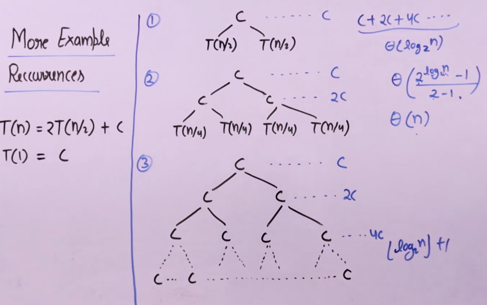
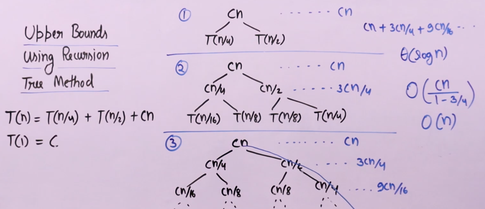
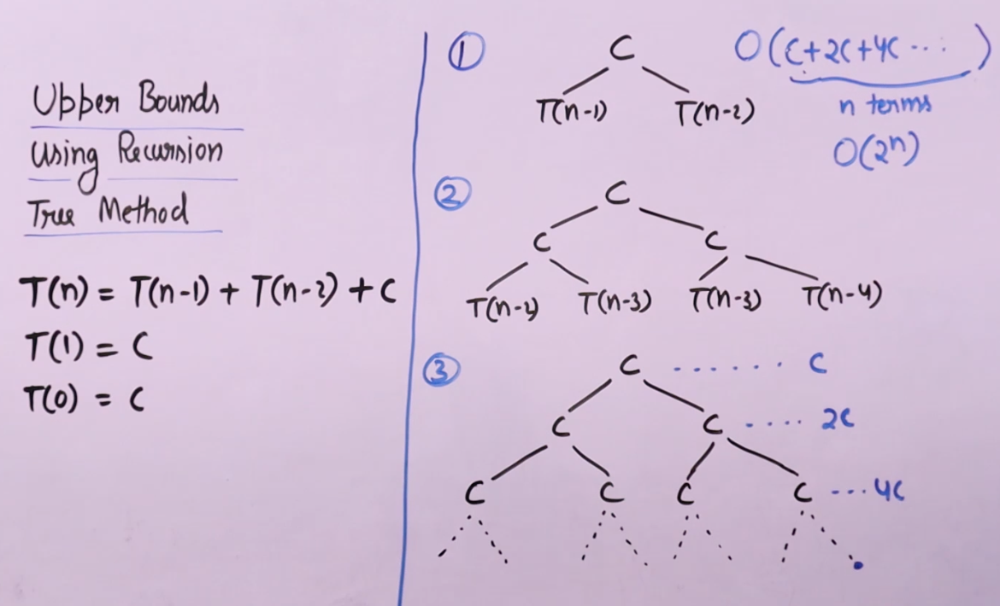

# Recursion Tree Method
To solve Recurrence Relations
- General Purpose Method
- In some cases, it gives only upper bound $ (O(n)) $

## Steps to draw Recursion Tree
- In nodes, write down the amount of work done in every function call.
- Write Non-Recursive part as root and Recursive part as children.
- Keep expanding until a pattern is observed.
- Compute total work done in whole Recursion Tree by counting Sum of all node values
    - Sum of 1st level + Sum of 2nd level .... 
    - Till we find a pattern and calculate Sum of whole series.

## Example 1 - Merge Sort

- In above example, recursive part is $ 2 T(\frac{n}{2}) $ and non-recursive part is $ Cn $.
- We write $ Cn $ as root and $ T(\frac{n}{2}) $ as children.
- Then we expand it further.
- We calculate Sum of all levels (which is $ Cn $).
- Calculate Height of Binary Tree (how many levels are there)
- Add $ Cn $ that number of times.
- Example, $ n = 14 $, tree would be $ 14 \to 7 \to 3 \to 1 $ (4 levels)
- Example, $ n = 14 $, tree would be $ 15 \to 7 \to 3 \to 1 $ (4 levels)
- Example, $ n = 14 $, tree would be $ 16 \to 8 \to 4 \to 2 \to 1 $ (5 levels)
- So, Height of Binary Tree is $ \log (n) $
- Sum $ \to (Cn + Cn + Cn) .... \log(n) \quad times $
- Total work done $ \log(n)*Cn $

### Time Complexity $ \theta(n \log(n)) $

## Example 2 - Tower of Hanoi

## Example 3 - Binary search

## Example 4

## Upper Bound using Recursion Tree Method

- Recurrence where one term is changing at different speed than other, we can find Upper Bound only.
- Because, all leaves are not at same level.
- We assume that tree is full.
- We find an Upper Bound.
- If, the common ratio (r) of GP is $ r \lt 1 $, we find Sum of Infinite Series

## Example 5

## Example 6

