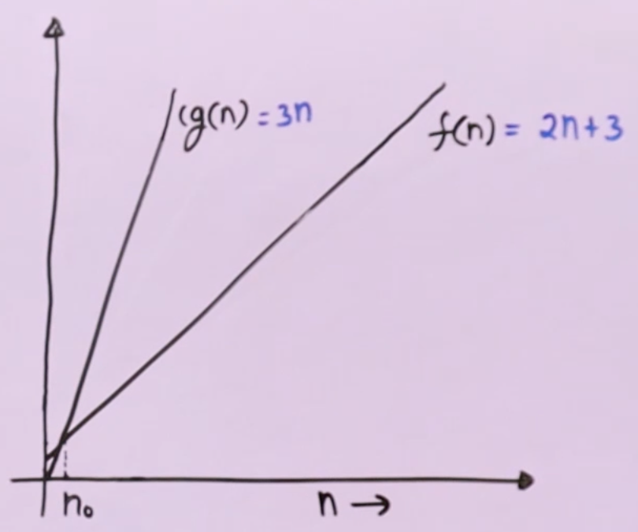

# Big O Notation $\quad O(n)$

It is used to represent Exact or Upper Bound on Order of Growth

### Steps
- Ignore lower order terms
- Ignore leading term constant

### Example

- $3n^2 + 5n + 6 \qquad O(n^2)$
- $3n + 10n\log n + 3 \qquad O(n\log n)$
- $10n^3 + 40n + 10 \qquad O(n^3)$

## Mathematical Representation of Big O Notation

We say $f(n) = O(g(n)) \qquad iff$  there exist constants $C$ (where $C > 0$) and $n_0$ (where $n_0 > 0$) such that $f(n) \le Cg(n)$ for all $n \ge n_0$

### Example

$f(n) = 2n + 3$ 

can be written as $O(n)$ where ($g(n) = n$)

So, we say $f(n) = 2n + 3$ is $O(n)$, only when there exists a constant $C$ such that 

$2n+3 \le Cn$, for all $n \ge n_0$

We need to find value of $C$ and $n_0$ and show that this is true.

### Proof

$$f(n) = 2n + 3$$

let $C = $ constant of highest growing term + 1.

$$C = 3$$
$$2n + 3 \le 3n$$
$$3 \le n$$
we get 
$$n_0 = 3$$




## Examples of $Big\ O$ Notation

$$\{ 100, \quad  \log 2000, \quad (10)^4, \quad ..... \} \quad \epsilon \quad O(1) $$

$$ \cup \quad \{ \frac{n}{4}, \quad 2n + 3, \quad \frac{n}{100} + \log n, \quad n + 10000, \quad \log n + 10, \quad  ..... \} \quad \epsilon \quad O(n) $$


$$ \cup \quad \{ n^2 + n, \quad 2n^2, \quad n^2 + 1000n, \quad n^2 + n\log n + n, \quad \frac{n^2}{1000}, \quad  ..... \} \quad \epsilon \quad O(n^2) $$


### Multiple Variables
Big O Notation works for Multiple Variables also

$100n^2 + 1000m + n \qquad O(n^2 + m)$ 

$1000m^2 + 200mn + 30m + 20n \qquad O(m^2 + mn)$

## Applications
Used when we have an Upper Bound

```
bool isPrime(int n)
    if (n == 1) return false;
    if (n == 2 || n == 3) return true;
    if (n % 2 == 0 || n % 3 == 0) return false;
    for (int i=0; i*i < n; i = i + 6)
        if (n % i == 0 || n % (i + 2) == 0)
            return false;
    return true;
```

- In certain cases it will run constant number of times
- In certain cases it will run maximum of $\frac{\sqrt{n} - 5}{6}$ times (because it starts with $5$, goes till $\sqrt{n}$, and increments by $6$

#### Time Complexity is $O(\sqrt{n})$