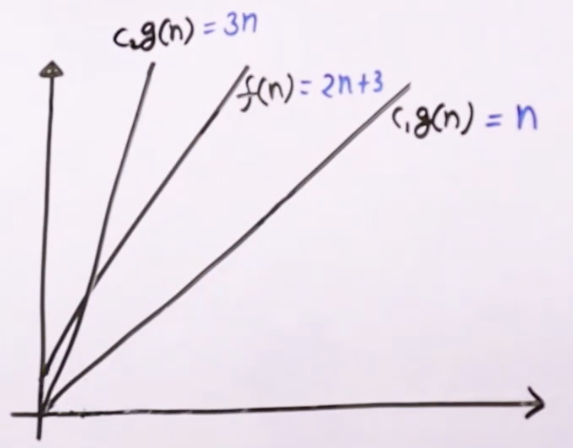
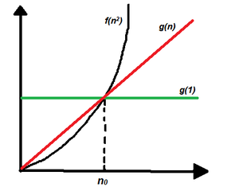

# Theta Notation $\quad \theta(n)$

It is used to represent Exact Bound on Order of Growth

### Steps
- Ignore lower order terms
- Ignore leading term constant

### Example

- $3n^2 + 5n + 6 \qquad \theta(n^2)$
- $3n + 10n\log n + 3 \qquad \theta(n\log n)$
- $10n^3 + 40n + 10 \qquad \theta(n^3)$

## Mathematical Representation of Theta Notation

We say $f(n) = \theta(g(n)) \qquad iff$  there exist constants $C_1$, $C_2$ (where $C_1 > 0$ and $C_2 > 0$) and $n_0$ (where $n_0 > 0$) such that $C_1g(n) \le f(n) \le C_2g(n)$ for all $n \ge n_0$

### Example

$f(n) = 2n + 3$ 

can be written as $\theta(n)$ where ($g(n) = n$)

So, we say $f(n) = 2n + 3$ is $\theta(n)$, only when there exists a constant $C_1$ and $C_2$ such that 

$C_1n \le 2n+3 \le C_2n$, for all $n \ge n_0$

We need to find value of $C_1$ and $C_2$ and $n_0$ and show that this is true.

### Proof

$$f(n) = 2n + 3$$

let $C_1 = $ constant of highest growing term - 1.
let $C_2 = $ constant of highest growing term + 1.

$$C_1 = 1 \quad and \quad C_2 = 3$$
$$1n \le 2n + 3 \le 3n$$
$$1n \le 2n + 3 \quad gives \quad n \ge -3 \quad$$
but we know $n_0 \ge 0$, so
$$1n \le 2n + 3 \quad gives \quad n \ge 0 \quad$$
$$2n + 3 \le 3n \quad gives \quad n \ge 3$$
we get 
$$n_0 = 3$$






## Examples of $Theta$  Notation

$$\{ 100, \quad  \log 2000, \quad (10)^4, \quad ..... \} \quad \epsilon \quad \theta(1) $$

$$ \{ \frac{n}{4}, \quad 2n + 3, \quad \frac{n}{100} + \log n, \quad n + 10000, \quad \log n + 10, \quad  ..... \} \quad \epsilon \quad \theta(n) $$


$$ \{ n^2 + n, \quad 2n^2, \quad n^2 + 1000n, \quad n^2 + n\log n + n, \quad \frac{n^2}{1000}, \quad  ..... \} \quad \epsilon \quad \theta(n^2) $$


## Relation with Big O and Omega Notation

$$f(n) = \theta(g(n))$$
$$then \quad f(n) = O(g(n)) \quad and \quad f(n) = \Omega(g(n))$$
$$and \quad g(n) = O(f(n)) \quad and \quad g(n) = \Omega(f(n))$$


### Multiple Variables
Theta Notation works for Multiple Variables also

$100n^2 + 1000m + n \qquad \theta(n^2 + m)$ 

$1000m^2 + 200mn + 30m + 20n \qquad \theta(m^2 + mn)$

## Applications
Used when we have an Exact Bound

### Find element in array using Linear Search. 

```
bool linearSearch(int a[], int n, int key)
    for (int i = 0; i < n; i++)
        if (a[i] == key)
            return true;
    return false;
```

- Time Complexity is $\theta(n)$ as we're traversing through array
